# DealHub — Process Flows

Process flows for every major situation in the app. Use these to reason about navigation, API calls, and edge cases.

---

## 1. Request & auth (middleware)

Every request passes through middleware. Auth and route protection happen here.

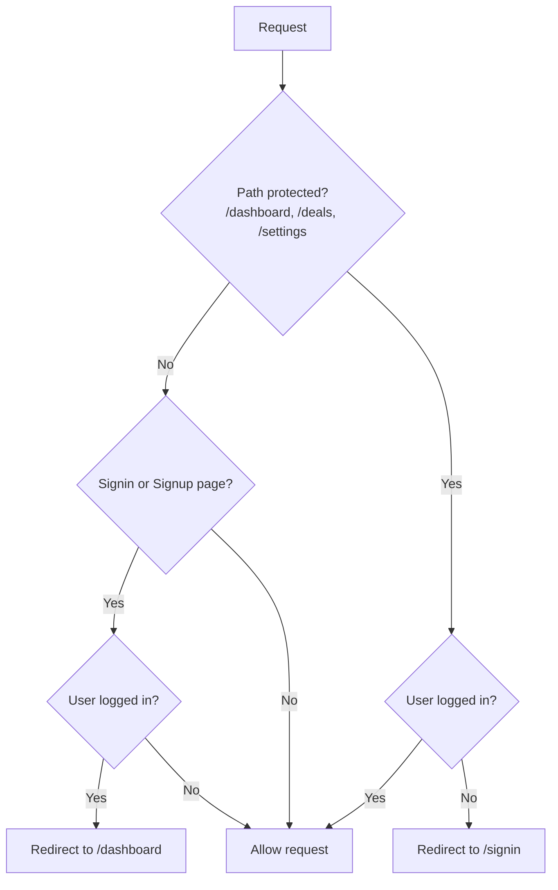

**Outcomes**

| Situation | Result |
|-----------|--------|
| Protected route, no user | → `/signin` |
| Protected route, user | → Page loads |
| `/signin` or `/signup`, user | → `/dashboard` |
| `/signin` or `/signup`, no user | → Auth page loads |
| `/`, other public | → Page loads |

---

## 2. Sign in & sign up

**Sign in**

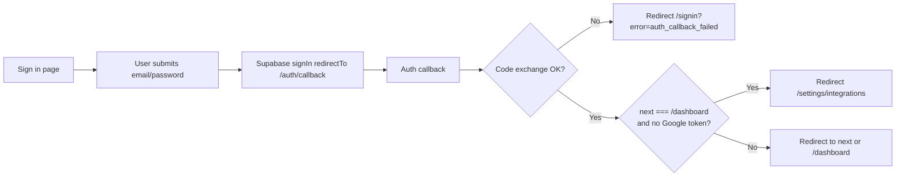

**Sign up**

- Same redirect: Supabase → `/auth/callback` → then same logic as sign-in (integrations if first time, else `next` or dashboard).

---

## 3. Deal creation

Create deal can be **paste** (paste listing → extract facts) or **manual** (form only). Both submit to `POST /api/deals`.

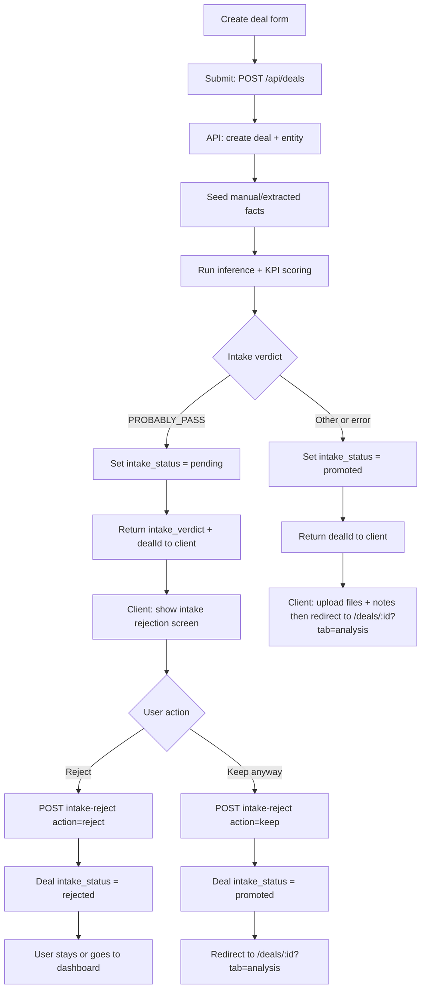

**Situations**

| Situation | What happens |
|-----------|----------------|
| Verdict ≠ PROBABLY_PASS | Deal promoted, client uploads files/notes, then redirect to deal Analysis tab. |
| Verdict = PROBABLY_PASS | Rejection screen; files already uploaded. User **Reject** → deal rejected; **Keep anyway** → promoted, redirect to deal. |
| API/network error | Error state on form, no redirect. |
| Pipeline failure in API | Deal is promoted so it does not stay pending. |

---

## 4. Deal page load

```mermaid
flowchart TD
  A[GET /deals/:id] --> B{Middleware: user?}
  B -->|No| C[Redirect /signin]
  B -->|Yes| D[buildDealPageViewModel]
  D --> E{VM built?}
  E -->|No| F[notFound 404]
  E -->|Yes| G{deal.intake_status}
  G -->|rejected| H[Redirect /dashboard]
  G -->|pending or promoted or null| I[Load page: header, tabs, data]
  I --> J[Optional ?tab= workspace|facts|analysis]
```

**Situations**

| Situation | Result |
|-----------|--------|
| Not logged in | → `/signin` (middleware). |
| Deal missing / VM fails | → 404. |
| Deal rejected | → Redirect to dashboard. |
| Deal exists, not rejected | → Deal page; tab from query or default. |

---

## 5. Deal page — tabs & “View source”

```mermaid
flowchart TD
  A[Deal page] --> B[Active tab: Workspace | Facts | Analysis]
  B --> C{User action}
  C -->|Click another tab| D[Set activeTab, render that tab]
  C -->|Click source link in Facts/Analysis| E[onViewSourceInWorkspace fileId]
  E --> F[setHighlightFileId, setActiveTab = workspace]
  F --> G[Workspace tab: IntakeSection receives highlightFileId]
  G --> H[Select file, open detail modal if needed]
```

**Situations**

| Situation | Result |
|-----------|--------|
| Switch tab | Content switches to Workspace / Facts / Analysis. |
| “View source” on a fact or metric | Switch to Workspace, file highlighted/selected and modal opened if used. |

---

## 6. File upload (on a deal)

User uploads files from the deal’s Workspace (or during create flow).

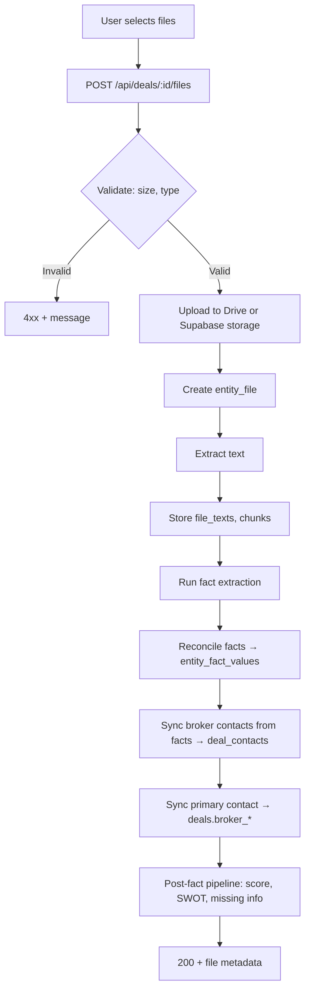

**Situations**

| Situation | Result |
|-----------|--------|
| File too large / wrong type | Validation error, no upload. |
| Drive error | Fallback to Supabase storage when implemented; else error. |
| Extract / pipeline error | Often non-fatal; file and text stored, later steps may be partial or retried. |

---

## 7. Intake rejection — Reject vs Keep

Shown only when create deal returns `intake_verdict === "PROBABLY_PASS"`.

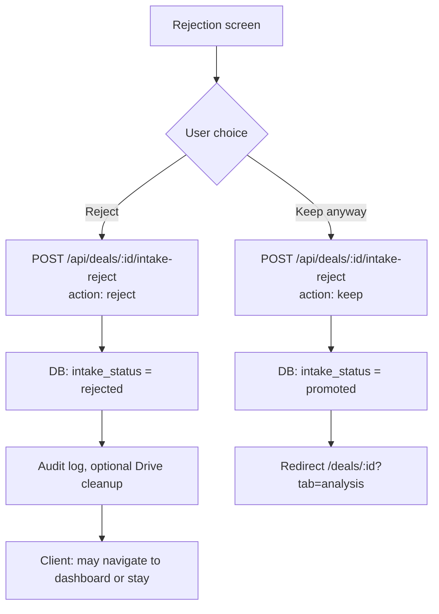

---

## 8. Settings pages

All under `/settings/*`; require auth (middleware). Sub-nav: Integrations, Buyer Profile (two items only).

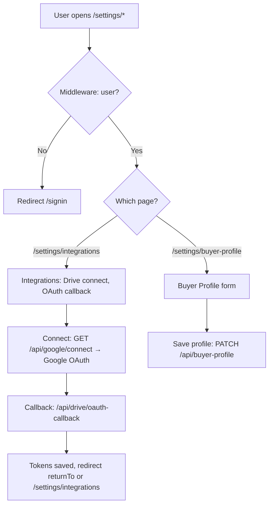

**Situations**

| Situation | Result |
|-----------|--------|
| Not logged in | → `/signin`. |
| Integrations — Connect Google | OAuth → callback → tokens stored, redirect back. |
| Integrations — OAuth error | Redirect to `/settings/integrations?error=...`. |
| Buyer profile — Save | PATCH to API; success/error in UI. |

---

## 9. Google Drive OAuth callback

Used when connecting Drive from Settings.

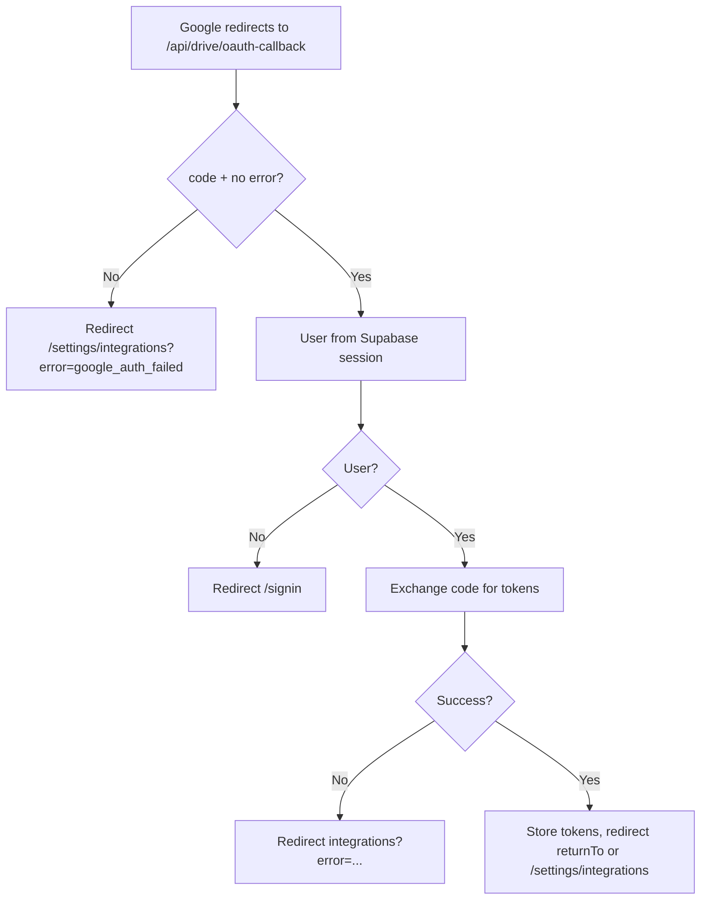

---

## 10. Buyer profile (settings)

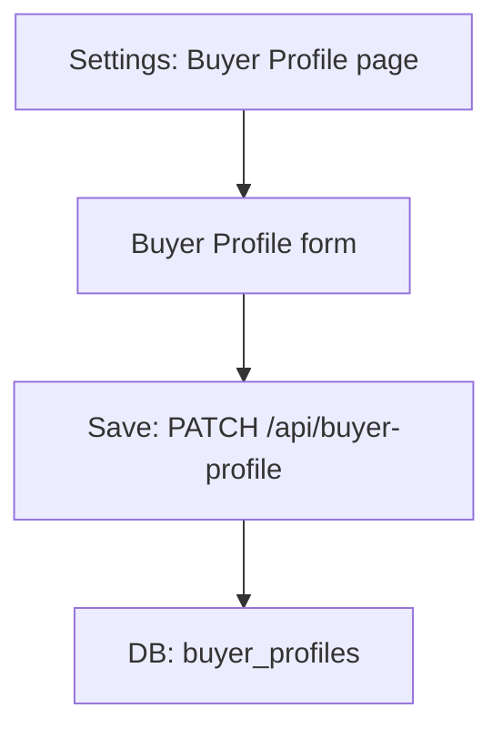

---

## 11. Dashboard — deal list & empty states

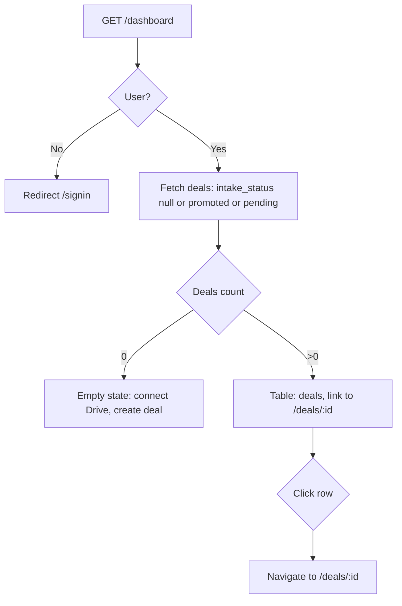

Rejected deals are excluded from the list. Pending deals are shown (e.g. “New” or similar).

---

## 12. Deal not found & rejected access

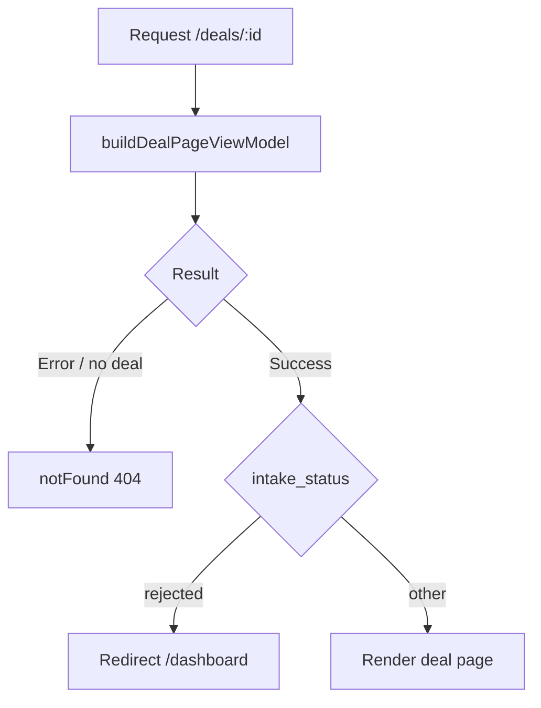

---

## 13. View source from Facts or Analysis

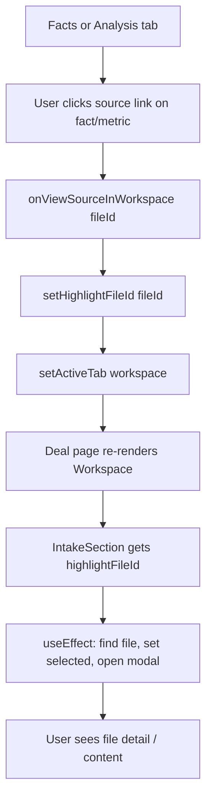

---

## 14. Create deal — paste mode with extraction

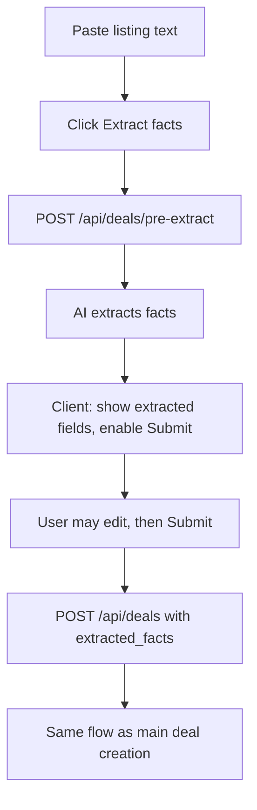

---

## 15. NDA state (deal)

NDA is tracked separately from intake; deal page can show NDA signed / review / pending based on NDA detection and user actions (no separate flow here; state is read from deal/entity and displayed).

---

## Summary table — “Where do I end up?”

| From | Condition | To |
|------|-----------|----|
| Any protected URL | Not logged in | `/signin` |
| `/signin`, `/signup` | Logged in | `/dashboard` |
| `/auth/callback` | Success, first time (no Drive token) | `/settings/integrations` |
| `/auth/callback` | Success, has Drive token or next set | `next` or `/dashboard` |
| Create deal submit | Verdict ≠ PROBABLY_PASS | `/deals/:id?tab=analysis` |
| Create deal submit | Verdict = PROBABLY_PASS | Rejection screen → Reject (deal rejected) or Keep → `/deals/:id?tab=analysis` |
| `/deals/:id` | Deal rejected | `/dashboard` |
| `/deals/:id` | Deal not found | 404 |
| Facts/Analysis “View source” | Click link | Workspace tab, file highlighted |
| Settings (any) | Not logged in | `/signin` |

All flows assume middleware runs first; then page or API handler runs with the current user (or redirect).
